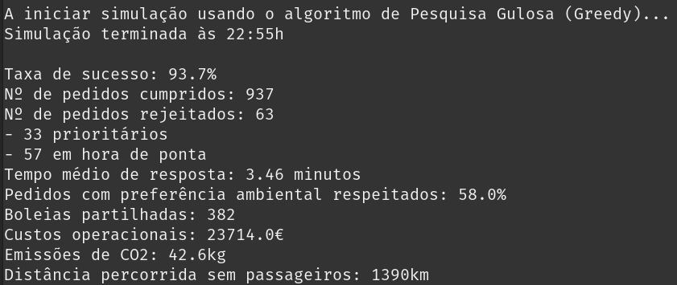

# IA (Inteligência Artificial) (Português)
Sistema de gestão de uma frota de táxis usando diferentes algoritmos de procura em simulações dinâmicas. Para obter informação mais detalhada é possível consultar o respetivo [enunciado](EnunciadoTPIA_PT.pdf) e [relatório](Relatorio.pdf).

## Membros do grupo:
- [Duarte Escairo Brandão Reis Silva](https://github.com/darteescar) (A106936)
- [Luís António Peixoto Soares](https://github.com/luis7788) (A106932)
- [Tiago Silva Figueiredo](https://github.com/tiagofigueiredo7) (A106856)
- [Inês Ferreira Ribeiro](https://github.com/inesferribeiro) (A104704)

### Nota Final: ?? / 20 ⭐️



## Executável
Para executar o programa, basta fazer:

```console
$ python3 main.py
```   

# IA (Artificial Intelligence) (English)
Fleet management system for taxis using different search algorithms in dynamic simulations. For more detailed information, you can consult the respective [statement](EnunciadoTPIA_EN.pdf) and [report](Relatorio_EN.pdf).

## Group Members:
- [Duarte Escairo Brandão Reis Silva](https://github.com/darteescar) (A106936)
- [Luís António Peixoto Soares](https://github.com/luis7788) (A106932)
- [Tiago Silva Figueiredo](https://github.com/tiagofigueiredo7) (A106856)
- [Inês Ferreira Ribeiro](https://github.com/inesferribeiro) (A104704)

### Final Grade: ?? / 20 ⭐️

## Executable
To run the program, just do:

```console
$ python3 main.py
```
